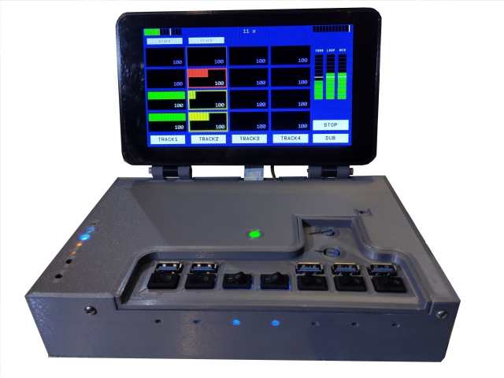

# rpi Bare Metal Looper

This repository contains the source code and other information required to
build a bare metal rPi based Audio Looper.

[](docs/images/Looper2.jpg)

Please see the **[docs/readme.md](docs/readme.md)** file for
the [documentation](docs/readme.md) regarding this project.

## Quick Start (USB Audio + APC Key25)

### Build

CI runs automatically on push to `master` via GitHub Actions, producing `kernel7l.img` (rPi 4, RASPPI=4 32-bit).

To build locally, clone into `circle/_prh/_apps/Looper/` with `circle/` as CIRCLEHOME and `circle/_prh/` as the circle-prh tree. Default build targets the Audio Injector Octo (CS42448). Add `LOOPER_USB_AUDIO=1` to target UCA222 / generic class-compliant USB audio (44100Hz stereo, 64-sample blocks) — requires `AudioInputUSB`/`AudioOutputUSB` stubs in circle-prh.

### Deploy to SD card (Windows)

Insert your FAT32 SD card as `E:` and run:

```powershell
.\deploy-to-sd.ps1
```

This downloads the latest `looper-sd.zip` release from GitHub and copies all files to `E:`.

### APC Key25 Controller Layout

The APC Key25 connects via a Teensy serial MIDI bridge. Each row controls one looper track directly — **boss-style, no track selector**.

| Column | Action |
|--------|--------|
| 0–3 | Drive track (row) through empty→record→play→overdub |
| 4 | Toggle mute all clips on track |
| 5 | Erase track |
| 6 | Set loop start point |
| 7 | Clear loop start point |

**Transport buttons:**

| Button | Normal | + Shift |
|--------|--------|---------|
| Stop All | Stop at loop point | Stop immediately |
| Record | Toggle dub mode | Abort recording |
| Play | Clear all | Loop immediately |

**LED colors:** green=playing, red=recording, yellow=pending transition, off=stopped/empty.
